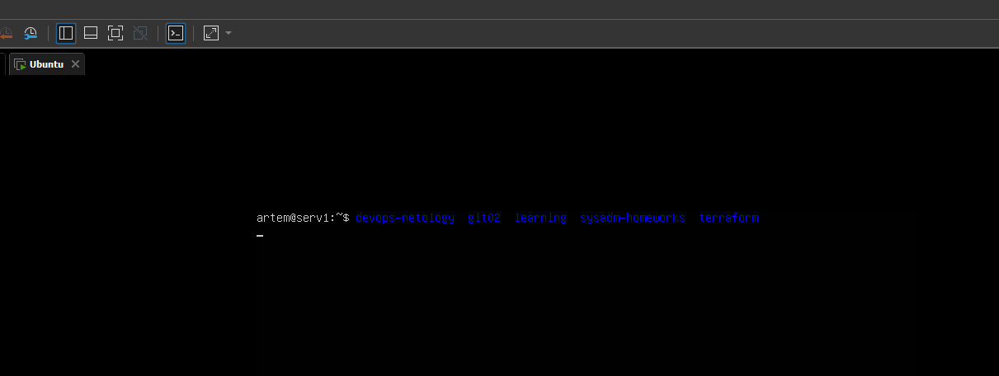

## 1. Какого типа команда `cd`?

Команда `cd` - встроенная в bash команда.

## 2. Какая альтернатива без pipe команде grep <some_string> <some_file> | wc -l?

Альтернатива данной конструкции - использовать ключ `-с`:
`grep <some_string> <some_file> -c`

## 3. Какой процесс с `PID 1` является родителем для всех процессов в вашей виртуальной машине Ubuntu 20.04?

Процесс systemd.

```bash
vagrant@vagrant:~# pstree -p
systemd(1)─┬─ModemManager(706)─┬─{ModemManager}(714)
...
```

## 4. Как будет выглядеть команда, которая перенаправит вывод stderr `ls` на другую сессию терминала?

`ls > /dev/pts/1`

## 5. Получится ли одновременно передать команде файл на stdin и вывести ее stdout в другой файл?

Да, получится:

```bash
vagrant@vagrant:~# echo "hello" > file
vagrant@vagrant:~# cat < file > outfile
vagrant@vagrant:~# cat outfile
hello
```

## 6. Получится ли вывести находясь в графическом режиме данные из PTY в какой-либо из эмуляторов TTY? Сможете ли вы наблюдать выводимые данные?

Да, получится:

```bash
artem@serv1:~$ who
artem    tty1         2022-08-16 13:32
artem    tty2         2022-08-16 13:33
artem    pts/0        2022-08-16 13:33 (192.168.75.1)
artem@serv1:~$ ls > /dev/tty1
```

На экране tty1 появился вывод команды `ls`.


## 7. Выполните команду `bash 5>&1`. К чему она приведет? Что будет, если вы выполните `echo netology > /proc/$$/fd/5`? Почему так происходит?

Команда `bash 5>&1` создаст новый `bash`, в котором создан дескриптор 5 перенаправляющий вывод в `stdout`. И команда `echo netology > /proc/$$/fd/5` направляя в 5 дескриптор выводит на экран `netology`.

## 8. Получится ли в качестве входного потока для pipe использовать только stderr команды, не потеряв при этом отображение stdout на pty? Напоминаем: по умолчанию через pipe передается только stdout команды слева от | на stdin команды справа. Это можно сделать, поменяв стандартные потоки местами через промежуточный новый дескриптор, который вы научились создавать в предыдущем вопросе

Получилось через два промежуточных дескриптора:

```bash
vagrant@vagrant:~$ ls /home 4>&2 5>&1 1>&4 2>&5 |grep file
vagrant
vagrant@vagrant:~$ ls /home1 4>&2 5>&1 1>&4 2>&5 |grep file
ls: cannot access '/home1': No such file or directory
```

## 9. Что выведет команда `cat /proc/$$/environ`? Как еще можно получить аналогичный по содержанию вывод?

Данная команда выведет переменные текущего окружения. Получить эти переменные можно командой `env`.

## 10. Используя `man`, опишите что доступно по адресам `/proc/<PID>/cmdline`, `/proc/<PID>/exe`

Исследую процесс ping 8.8.8.8 (pid 4813)

```bash
root@vagrant:/home/vagrant# ll /proc/4813/exe # указывает на исполняемый бинарник
lrwxrwxrwx 1 root root 0 Aug 17 08:34 /proc/4813/exe -> /usr/bin/ping*
root@vagrant:/home/vagrant# cat /proc/4813/cmdline # указывает на командную строку
ping8.8.8.8
```

```bash
/proc/[pid]/cmdline
              This read-only file holds the complete command line for the process,  unless the process is a zombie.
/proc/[pid]/exe
              Under  Linux  2.2 and later, this file is a symbolic link containing the actual pathname of the executed command.
```

## 11. Узнайте, какую наиболее старшую версию набора инструкций SSE поддерживает ваш процессор с помощью `/proc/cpuinfo`

Версия sse4_2

```bash
root@vagrant:~# grep sse /proc/cpuinfo
flags: fpu vme de pse tsc msr pae mce cx8 apic sep mtrr pge mca cmov pat pse36 clflush mmx fxsr sse sse2 ht syscall nx rdtscp lm constant_tsc rep_good nopl xtopology nonstop_tsc cpuid tsc_known_freq pni pclmulqdq ssse3 cx16 pcid sse4_1 sse4_2 x2apic movbe popcnt aes xsave avx rdrand hypervisor lahf_lm abm 3dnowprefetch invpcid_single fsgsbase avx2 invpcid rdseed clflushopt md_clear flush_l1d arch_capabilities
```

## 12. При открытии нового окна терминала и vagrant ssh создается новая сессия и выделяется pty. Это можно подтвердить командой tty, которая упоминалась в лекции 3.2. Однако

```bash
vagrant@netology1:~$ ssh localhost 'tty'
not a tty
```

### Почитайте, почему так происходит, и как изменить поведение

По умолчанию, когда запускаете команду на удаленном компьютере с помощью ssh, для удаленного сеанса не выделяется TTY и, допустим,  ssh localhost 'pwd' отрабатывает.
Чтобы сработал запрос tty, нужно запустить команду с флагом -t (Force pseudo-terminal allocation)
`ssh -t localhost 'tty'`

## 13. Например, так можно перенести в screen процесс, который вы запустили по ошибке в обычной SSH-сессии

Перенесу процесс `top` в screen:

```bash
vagrant@vagrant:~$ top
ctrl + z
vagrant@vagrant:~$ jobs -l
[1]+  2485 Stopped                 top
vagrant@vagrant:~$ bg
[1]+ top &
vagrant@vagrant:~$ ps -a
    PID TTY          TIME CMD
   1795 pts/3    00:00:00 sudo
   1797 pts/3    00:00:00 su
   1798 pts/3    00:00:00 bash
   2485 pts/0    00:00:00 top
   2496 pts/0    00:00:00 ps
vagrant@vagrant:~$ disown top
-bash: warning: deleting stopped job 1 with process group 2485
vagrant@vagrant:~$ screen
vagrant@vagrant:~$ reptyr 2485
```

## 14. Узнайте что делает команда `tee` и почему в отличие от `sudo echo` команда с `sudo tee` будет работать

Команда `tee` записывает вывод другой команды в один или несколько файлов.  
Конструкция `echo string | sudo tee /root/new_file` работает потому что перенаправление данных идёт под обычным пользователем, а запись в новый файл каталога рута с повышением прав.
