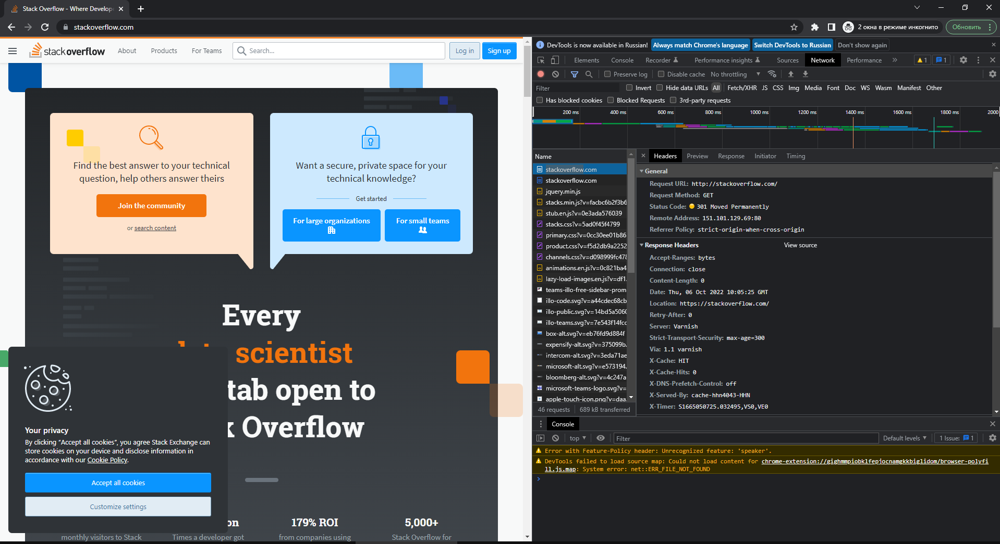
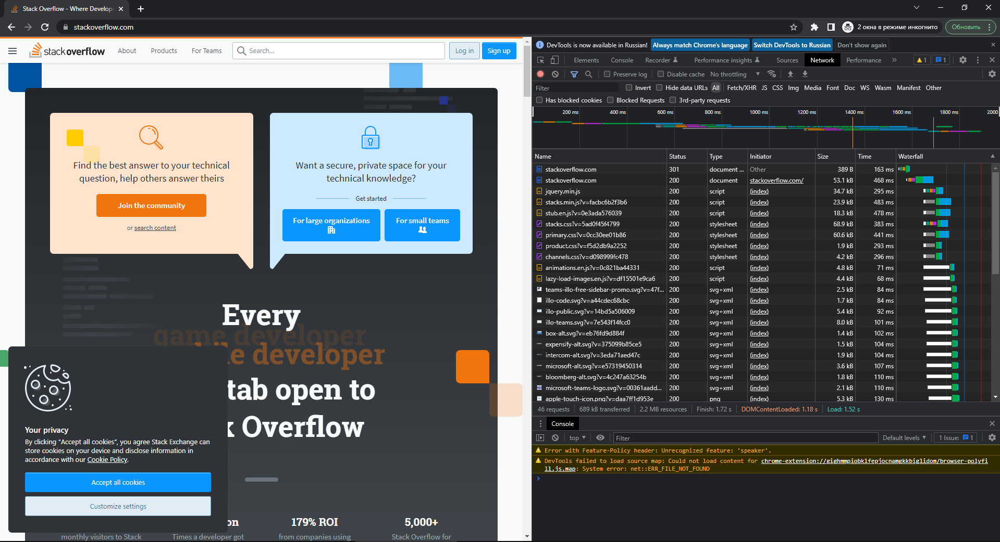

# Домашнее задание к занятию "3.6. Компьютерные сети, лекция 1"

1. Работа c HTTP через телнет.
- Подключитесь утилитой телнет к сайту stackoverflow.com
`telnet stackoverflow.com 80`
- отправьте HTTP запрос
```bash
GET /questions HTTP/1.0
HOST: stackoverflow.com
[press enter]
[press enter]
```
- В ответе укажите полученный HTTP код, что он означает?

Получен код `301 Moved Permanently` - это код редиректа, и отправляет он на `https`: `Location: https://stackoverflow.com/questions
`

2. Повторите задание 1 в браузере, используя консоль разработчика F12.
- откройте вкладку `Network`
- отправьте запрос http://stackoverflow.com
- найдите первый ответ HTTP сервера, откройте вкладку `Headers`
- укажите в ответе полученный HTTP код.
- проверьте время загрузки страницы, какой запрос обрабатывался дольше всего?
- приложите скриншот консоли браузера в ответ.

Решение:



Status Code: 301 Moved Permanently
Время загрузки страницы: 1,52s  
Дольше всего обрабаотывался: GET https://stackoverflow.com/ 468 ms


3. Какой IP адрес у вас в интернете?

Проверил на сайте ifconfig.me. Адрес 94.25.169.105

4. Какому провайдеру принадлежит ваш IP адрес? Какой автономной системе AS? Воспользуйтесь утилитой `whois`

```bash
root@vagrant:/home/vagrant# whois 94.25.169.105
...
descr:          YOTA	#провайдер
...
origin:         AS25159	#AS
```

5. Через какие сети проходит пакет, отправленный с вашего компьютера на адрес 8.8.8.8? Через какие AS? Воспользуйтесь утилитой `traceroute`

C vagrant машины tracroute выводит `***`, так что вывод с указанием AS с другой машины: 

```
traceroute to 8.8.8.8 (8.8.8.8), 30 hops max, 60 byte packets
 1  gw.ipv4.layer6.net (217.12.202.1) [AS59729]  0.387 ms  0.352 ms  0.283 ms
 2  USGR.IEV.29632.as (62.205.134.194) [AS8772/AS29632]  0.271 ms  0.249 ms  0.225 ms
 3  Google.peer.b-ix.net (185.1.30.10) [*]  0.711 ms  0.576 ms  0.637 ms
 4  108.170.250.161 (108.170.250.161) [AS15169]  33.870 ms  33.811 ms  33.914 ms
 5  209.85.142.65 (209.85.142.65) [AS15169]  33.814 ms 142.251.227.251 (142.251.227.251) [AS15169]  33.657 ms 142.251.227.195 (142.251.227.195) [AS15169]  34.069 ms
 6  dns.google (8.8.8.8) [AS15169]  33.800 ms  33.760 ms  33.706 ms
```

6. Повторите задание 5 в утилите `mtr`. На каком участке наибольшая задержка - delay?

`mtr` на вагрант машине сработал и наибольшая задержка на AS15169.

```
 Host                                                                                                                                       Loss%   Snt   Last   Avg  Best  Wrst StDev
 1. AS???    _gateway                                                                                                                       0.0%    23    0.4   0.3   0.2   0.4   0.0
 2. AS21928  172.50.0.1                                                                                                                      0.0%    23   72.5  90.8  69.7 193.5  33.2
 3. AS59729  gw.ipv4.layer6.net                                                                                                              0.0%    23   69.0  92.4  69.0 177.1  34.6
 4. AS8772   USGR.IEV.29632.as                                                                                                               0.0%    23   69.7  79.4  68.9 136.0  15.4
 5. AS???    Google.peer.b-ix.net                                                                                                            0.0%    23   74.4  89.8  70.6 192.6  29.9
 6. AS15169  108.170.250.177                                                                                                                 0.0%    22  105.0 136.9 104.3 253.6  46.3
 7. AS15169  209.85.254.243                                                                                                                  0.0%    22  114.5 129.5 104.2 398.4  62.7
 8. AS15169  dns.google                                                                                                                      0.0%    22  107.1 131.9 103.6 283.2  50.6

```

7. Какие DNS сервера отвечают за доменное имя dns.google? Какие A записи? воспользуйтесь утилитой `dig`

За доменное имя dns.google отвечают: ns1.zdns.google. ns2.zdns.google. ns3.zdns.google. ns4.zdns.google.
А записи: 8.8.4.4 8.8.8.8.

```
root@vagrant:/home/vagrant# dig +trace dns.google

; <<>> DiG 9.16.1-Ubuntu <<>> +trace dns.google
;; global options: +cmd
.                       39755   IN      NS      a.root-servers.net.
.                       39755   IN      NS      b.root-servers.net.
.                       39755   IN      NS      c.root-servers.net.
.                       39755   IN      NS      d.root-servers.net.
.                       39755   IN      NS      e.root-servers.net.
.                       39755   IN      NS      f.root-servers.net.
.                       39755   IN      NS      g.root-servers.net.
.                       39755   IN      NS      h.root-servers.net.
.                       39755   IN      NS      i.root-servers.net.
.                       39755   IN      NS      j.root-servers.net.
.                       39755   IN      NS      k.root-servers.net.
.                       39755   IN      NS      l.root-servers.net.
.                       39755   IN      NS      m.root-servers.net.
;; Received 262 bytes from 127.0.0.53#53(127.0.0.53) in 43 ms

google.                 172800  IN      NS      ns-tld1.charlestonroadregistry.com.
google.                 172800  IN      NS      ns-tld2.charlestonroadregistry.com.
google.                 172800  IN      NS      ns-tld3.charlestonroadregistry.com.
google.                 172800  IN      NS      ns-tld4.charlestonroadregistry.com.
google.                 172800  IN      NS      ns-tld5.charlestonroadregistry.com.
google.                 86400   IN      DS      6125 8 2 80F8B78D23107153578BAD3800E9543500474E5C30C29698B40A3DB2 3ED9DA9F
google.                 86400   IN      RRSIG   DS 8 1 86400 20221019050000 20221006040000 18733 . xeDz4JDWXSrUqq8FPGIhLXNgHRHckRiZoOYIWzJDmeaquiJGENeLNEm1 bn20xutSaxEY80GH8AvO7rbDXqT+1Lk059oMO7DxH/lWdDyzys04xhNY bBs1TDOsh7b/yPojpYbKpobeUTG9WaI68GA/vfunonwE0nQRAKVLMJqU AOtXKMirRb2IuGe8bQf1IOfbdnNtovnSt2pYEF7C+E3U6xhaj5K9NV8k HFMKUBZq5AbYvKiedPBV/CmzSND3oME64au4K+0hCnaMt3ovnxCGDYnu 8hc69YgaVS1YttCGyRWjObt7OsXbzefZS+HxGFahpRB6djqZttD9fkHG DRvZIw==
;; Received 730 bytes from 198.41.0.4#53(a.root-servers.net) in 63 ms

dns.google.             10800   IN      NS      ns2.zdns.google.
dns.google.             10800   IN      NS      ns4.zdns.google.
dns.google.             10800   IN      NS      ns3.zdns.google.
dns.google.             10800   IN      NS      ns1.zdns.google.
dns.google.             3600    IN      DS      56044 8 2 1B0A7E90AA6B1AC65AA5B573EFC44ABF6CB2559444251B997103D2E4 0C351B08
dns.google.             3600    IN      RRSIG   DS 8 2 3600 20221025144231 20221003144231 28641 google. MEz1iHv15M9l3zH5292x9gv1MCHyKYVihyTu6xEZnmeb2HBnz3b+Z0qU BXqeXz6BQVUv/GUXUYE7xrGC+zSPBmhnaP3f7PMqb31OFU2LJ/uOOLXa WkFQrjMPENUUu8gti0c6qlD1AzhbxdznI1HXx0e60Ky9hiFjwz00V85K QsY=
;; Received 506 bytes from 216.239.36.105#53(ns-tld3.charlestonroadregistry.com) in 39 ms

dns.google.             900     IN      A       8.8.4.4
dns.google.             900     IN      A       8.8.8.8
dns.google.             900     IN      RRSIG   A 8 2 900 20221024182720 20221002182720 1831 dns.google. Fjct83ZFXTcWnd7LioR34uSYKDlgWUUC295T1z9pYxKs5wrWRNJaolOq xTsqV9Ow3kYoGFUBvKdrPUt1O6ARigrUkzY7votK/o3wolv5VjBDfneA GZsTGLFQ3WR7hvqsr85e/VwwaH/b5DqZzYLxdPV2uZeSyX5I5eY1Ceyu eco=
;; Received 241 bytes from 216.239.32.114#53(ns1.zdns.google) in 83 ms
```

8. Проверьте PTR записи для IP адресов из задания 7. Какое доменное имя привязано к IP? воспользуйтесь утилитой `dig`

8.8.4.4 - RTR 4.4.8.8.in-addr.arpa. имя dns.google.
8.8.8.8 - RTR 8.8.8.8.in-addr.arpa. имя dns.google.

```
root@vagrant:/home/vagrant# dig -x 8.8.4.4

; <<>> DiG 9.16.1-Ubuntu <<>> -x 8.8.4.4
;; global options: +cmd
;; Got answer:
;; ->>HEADER<<- opcode: QUERY, status: NOERROR, id: 44767
;; flags: qr rd ra; QUERY: 1, ANSWER: 1, AUTHORITY: 0, ADDITIONAL: 1

;; OPT PSEUDOSECTION:
; EDNS: version: 0, flags:; udp: 65494
;; QUESTION SECTION:
;4.4.8.8.in-addr.arpa.          IN      PTR

;; ANSWER SECTION:
4.4.8.8.in-addr.arpa.   17902   IN      PTR     dns.google.

;; Query time: 39 msec
;; SERVER: 127.0.0.53#53(127.0.0.53)
;; WHEN: Thu Oct 06 09:40:40 UTC 2022
;; MSG SIZE  rcvd: 73

root@vagrant:/home/vagrant# dig -x 8.8.8.8

; <<>> DiG 9.16.1-Ubuntu <<>> -x 8.8.8.8
;; global options: +cmd
;; Got answer:
;; ->>HEADER<<- opcode: QUERY, status: NOERROR, id: 51445
;; flags: qr rd ra; QUERY: 1, ANSWER: 1, AUTHORITY: 0, ADDITIONAL: 1

;; OPT PSEUDOSECTION:
; EDNS: version: 0, flags:; udp: 65494
;; QUESTION SECTION:
;8.8.8.8.in-addr.arpa.          IN      PTR

;; ANSWER SECTION:
8.8.8.8.in-addr.arpa.   6449    IN      PTR     dns.google.

;; Query time: 0 msec
;; SERVER: 127.0.0.53#53(127.0.0.53)
;; WHEN: Thu Oct 06 09:40:45 UTC 2022
;; MSG SIZE  rcvd: 73
```