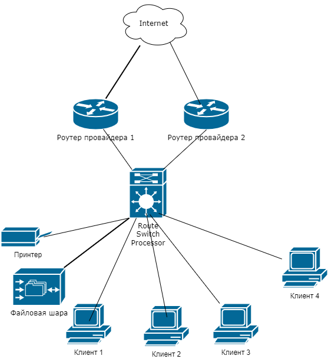

# Домашнее задание к занятию "3.8. Компьютерные сети, лекция 3"

1. Подключитесь к публичному маршрутизатору в интернет. Найдите маршрут к вашему публичному IP
```
telnet route-views.routeviews.org
Username: rviews
show ip route x.x.x.x/32
show bgp x.x.x.x/32
```
Решение:
```bash
route-views>show ip route 94.25.170.124
Routing entry for 94.25.168.0/22
  Known via "bgp 6447", distance 20, metric 0
  Tag 3303, type external
  Last update from 217.192.89.50 3w3d ago
  Routing Descriptor Blocks:
  * 217.192.89.50, from 217.192.89.50, 3w3d ago
      Route metric is 0, traffic share count is 1
      AS Hops 3
      Route tag 3303
      MPLS label: none

```

```bash
route-views>show bgp 94.25.170.124
BGP routing table entry for 94.25.168.0/22, version 2418882025
Paths: (23 available, best #22, table default)
  Not advertised to any peer
  Refresh Epoch 1
  3267 31133 25159, (aggregated by 25159 10.97.0.229)
    194.85.40.15 from 194.85.40.15 (185.141.126.1)
      Origin IGP, metric 0, localpref 100, valid, external
      path 7FE04CAF0FA8 RPKI State valid
      rx pathid: 0, tx pathid: 0
  Refresh Epoch 1
  3333 31133 25159, (aggregated by 25159 10.97.0.229)
    193.0.0.56 from 193.0.0.56 (193.0.0.56)
      Origin IGP, localpref 100, valid, external
      path 7FE14BD155A0 RPKI State valid
      rx pathid: 0, tx pathid: 0
  Refresh Epoch 1
  7018 1299 31133 25159, (aggregated by 25159 10.97.0.229)
    12.0.1.63 from 12.0.1.63 (12.0.1.63)
      Origin IGP, localpref 100, valid, external
      Community: 7018:5000 7018:37232
      path 7FE13957A010 RPKI State valid
      rx pathid: 0, tx pathid: 0
  Refresh Epoch 1
  57866 9002 31133 25159, (aggregated by 25159 10.97.0.229)
    37.139.139.17 from 37.139.139.17 (37.139.139.17)
      Origin IGP, metric 0, localpref 100, valid, external
      Community: 9002:9002 9002:64623 57866:100 65100:9002 65103:1 65104:31
      unknown transitive attribute: flag 0xE0 type 0x20 length 0x30
        value 0000 E20A 0000 0064 0000 232A 0000 E20A
              0000 0065 0000 0064 0000 E20A 0000 0067
              0000 0001 0000 E20A 0000 0068 0000 001F

      path 7FE09CC4C2B8 RPKI State valid
      rx pathid: 0, tx pathid: 0
  Refresh Epoch 1
  4901 6079 31133 25159, (aggregated by 25159 10.97.0.229)
    162.250.137.254 from 162.250.137.254 (162.250.137.254)
      Origin IGP, localpref 100, valid, external
      Community: 65000:10100 65000:10300 65000:10400
      path 7FE170E3A968 RPKI State valid
      rx pathid: 0, tx pathid: 0
  Refresh Epoch 1
  8283 31133 25159, (aggregated by 25159 10.97.0.229)
    94.142.247.3 from 94.142.247.3 (94.142.247.3)
      Origin IGP, metric 0, localpref 100, valid, external
      Community: 8283:1 8283:101 8283:102
      unknown transitive attribute: flag 0xE0 type 0x20 length 0x24
        value 0000 205B 0000 0000 0000 0001 0000 205B
              0000 0005 0000 0001 0000 205B 0000 0005
              0000 0002
      path 7FE041153B78 RPKI State valid
      rx pathid: 0, tx pathid: 0
  Refresh Epoch 1
  20130 6939 31133 25159, (aggregated by 25159 10.97.0.229)
    140.192.8.16 from 140.192.8.16 (140.192.8.16)
      Origin IGP, localpref 100, valid, external
      path 7FE04C7ED918 RPKI State valid
      rx pathid: 0, tx pathid: 0
  Refresh Epoch 1
  20912 3257 174 31133 25159, (aggregated by 25159 10.97.0.229)
    212.66.96.126 from 212.66.96.126 (212.66.96.126)
      Origin IGP, localpref 100, valid, external
      Community: 3257:8070 3257:30155 3257:50001 3257:53900 3257:53902 20912:65004
      path 7FE035EADEC0 RPKI State valid
      rx pathid: 0, tx pathid: 0
  Refresh Epoch 1
  49788 12552 31133 25159, (aggregated by 25159 10.97.0.229)
    91.218.184.60 from 91.218.184.60 (91.218.184.60)
      Origin IGP, localpref 100, valid, external
      Community: 12552:12000 12552:12100 12552:12101 12552:22000
      Extended Community: 0x43:100:1
      path 7FE09C65D3E8 RPKI State valid
      rx pathid: 0, tx pathid: 0
  Refresh Epoch 1
  6939 31133 25159, (aggregated by 25159 10.97.0.229)
    64.71.137.241 from 64.71.137.241 (216.218.252.164)
      Origin IGP, localpref 100, valid, external
      path 7FE019D52F70 RPKI State valid
      rx pathid: 0, tx pathid: 0
  Refresh Epoch 1
  53767 174 31133 25159, (aggregated by 25159 10.97.0.229)
    162.251.163.2 from 162.251.163.2 (162.251.162.3)
      Origin IGP, localpref 100, valid, external
      Community: 174:21101 174:22028 53767:5000
      path 7FE15D2B0BD8 RPKI State valid
      rx pathid: 0, tx pathid: 0
  Refresh Epoch 1
  7660 2516 1299 31133 25159, (aggregated by 25159 10.97.0.229)
    203.181.248.168 from 203.181.248.168 (203.181.248.168)
      Origin IGP, localpref 100, valid, external
      Community: 2516:1030 7660:9001
      path 7FE13BAEF668 RPKI State valid
      rx pathid: 0, tx pathid: 0
  Refresh Epoch 1
  101 174 31133 25159, (aggregated by 25159 10.97.0.229)
    209.124.176.223 from 209.124.176.223 (209.124.176.223)
      Origin IGP, localpref 100, valid, external
      Community: 101:20100 101:20110 101:22100 174:21101 174:22028
      Extended Community: RT:101:22100
      path 7FE18AD3DF48 RPKI State valid
      rx pathid: 0, tx pathid: 0
  Refresh Epoch 1
  3561 209 3356 174 31133 25159, (aggregated by 25159 10.97.0.229)
    206.24.210.80 from 206.24.210.80 (206.24.210.80)
      Origin IGP, localpref 100, valid, external
      path 7FE1362AA938 RPKI State valid
      rx pathid: 0, tx pathid: 0
  Refresh Epoch 1
  701 174 31133 25159, (aggregated by 25159 10.97.0.229)
    137.39.3.55 from 137.39.3.55 (137.39.3.55)
      Origin IGP, localpref 100, valid, external
      path 7FE0A732DEB0 RPKI State valid
      rx pathid: 0, tx pathid: 0
  Refresh Epoch 1
  3356 174 31133 25159, (aggregated by 25159 10.97.0.229)
    4.68.4.46 from 4.68.4.46 (4.69.184.201)
      Origin IGP, metric 0, localpref 100, valid, external
      Community: 3356:3 3356:22 3356:86 3356:575 3356:666 3356:901 3356:2012
      path 7FE150B0EA70 RPKI State valid
      rx pathid: 0, tx pathid: 0
  Refresh Epoch 1
  19214 174 31133 25159, (aggregated by 25159 10.97.0.229)
    208.74.64.40 from 208.74.64.40 (208.74.64.40)
      Origin IGP, localpref 100, valid, external
      Community: 174:21101 174:22028
      path 7FE14B49A210 RPKI State valid
      rx pathid: 0, tx pathid: 0
  Refresh Epoch 1
  1351 6939 31133 25159, (aggregated by 25159 10.97.0.229)
    132.198.255.253 from 132.198.255.253 (132.198.255.253)
      Origin IGP, localpref 100, valid, external
      path 7FE15BE01900 RPKI State valid
      rx pathid: 0, tx pathid: 0
  Refresh Epoch 1
  852 31133 25159, (aggregated by 25159 10.97.0.229)
    154.11.12.212 from 154.11.12.212 (96.1.209.43)
      Origin IGP, metric 0, localpref 100, valid, external
      path 7FE0CD5A1FB0 RPKI State valid
      rx pathid: 0, tx pathid: 0
  Refresh Epoch 1
  3549 3356 174 31133 25159, (aggregated by 25159 10.97.0.229)
    208.51.134.254 from 208.51.134.254 (67.16.168.191)
      Origin IGP, metric 0, localpref 100, valid, external
      Community: 3356:3 3356:22 3356:86 3356:575 3356:666 3356:901 3356:2011 3549:2581 3549:30840
      path 7FE131ED8B38 RPKI State valid
      rx pathid: 0, tx pathid: 0
  Refresh Epoch 3
  2497 174 31133 25159, (aggregated by 25159 10.97.0.229)
    202.232.0.2 from 202.232.0.2 (58.138.96.254)
      Origin IGP, localpref 100, valid, external
      path 7FE1014E5AA8 RPKI State valid
      rx pathid: 0, tx pathid: 0
  Refresh Epoch 1
  3303 31133 25159, (aggregated by 25159 10.97.0.229)
    217.192.89.50 from 217.192.89.50 (138.187.128.158)
      Origin IGP, localpref 100, valid, external, best
      Community: 3303:1004 3303:1006 3303:1030 3303:3056
      path 7FE0EFC3F6B0 RPKI State valid
      rx pathid: 0, tx pathid: 0x0
  Refresh Epoch 1
  3257 1299 31133 25159, (aggregated by 25159 10.97.0.229)
    89.149.178.10 from 89.149.178.10 (213.200.83.26)
      Origin IGP, metric 10, localpref 100, valid, external
      Community: 3257:8794 3257:30052 3257:50001 3257:54900 3257:54901
      path 7FE148E0BD58 RPKI State valid
      rx pathid: 0, tx pathid: 0
```

2. Создайте dummy0 интерфейс в Ubuntu. Добавьте несколько статических маршрутов. Проверьте таблицу маршрутизации.

```bash
root@vagrant:~# cat /etc/netplan/02-dummy0.yaml
network:
  version: 2
  renderer: networkd
  bridges:
    dummy0:
      dhcp4: no
      dhcp6: no
      accept-ra: no
      interfaces: [ ]
      addresses:
        - 172.0.0.1/32
root@vagrant:~# netplan apply
root@vagrant:~# ip a
1: lo: <LOOPBACK,UP,LOWER_UP> mtu 65536 qdisc noqueue state UNKNOWN group default qlen 1000
    link/loopback 00:00:00:00:00:00 brd 00:00:00:00:00:00
    inet 127.0.0.1/8 scope host lo
       valid_lft forever preferred_lft forever
    inet6 ::1/128 scope host
       valid_lft forever preferred_lft forever
2: eth0: <BROADCAST,MULTICAST,UP,LOWER_UP> mtu 1500 qdisc fq_codel state UP group default qlen 1000
    link/ether 08:00:27:a2:6b:fd brd ff:ff:ff:ff:ff:ff
    inet 10.0.2.15/24 brd 10.0.2.255 scope global dynamic eth0
       valid_lft 86397sec preferred_lft 86397sec
    inet6 fe80::a00:27ff:fea2:6bfd/64 scope link
       valid_lft forever preferred_lft forever
3: dummy0: <BROADCAST,MULTICAST,UP,LOWER_UP> mtu 1500 qdisc noqueue state UNKNOWN group default qlen 1000
    link/ether 76:30:8d:94:94:9d brd ff:ff:ff:ff:ff:ff
    inet 172.0.0.1/32 scope global dummy0
       valid_lft forever preferred_lft forever
    inet6 fe80::7430:8dff:fe94:949d/64 scope link
       valid_lft forever preferred_lft forever
root@vagrant:~# ip ro add 172.0.0.1/32 via 10.0.2.15
root@vagrant:~# ip -br r
default via 10.0.2.2 dev eth0 proto dhcp src 10.0.2.15 metric 100
10.0.2.0/24 dev eth0 proto kernel scope link src 10.0.2.15
10.0.2.2 dev eth0 proto dhcp scope link src 10.0.2.15 metric 100
172.0.0.1 via 10.0.2.15 dev eth0
```

3. Проверьте открытые TCP порты в Ubuntu, какие протоколы и приложения используют эти порты? Приведите несколько примеров.

```bash
root@vagrant:~# ss -tulpn | grep LISTEN
tcp     LISTEN   0        128               0.0.0.0:22            0.0.0.0:*      users:(("sshd",pid=721,fd=3))
tcp     LISTEN   0        4096        127.0.0.53%lo:53            0.0.0.0:*      users:(("systemd-resolve",pid=630,fd=13))
tcp     LISTEN   0        128                  [::]:22               [::]:*      users:(("sshd",pid=721,fd=4))
```
Открыт порт 22 - ssh, 53 - loopback интерфейса.

4. Проверьте используемые UDP сокеты в Ubuntu, какие протоколы и приложения используют эти порты?

```bash
root@vagrant:~# ss -paun
State            Recv-Q           Send-Q                      Local Address:Port                      Peer Address:Port           Process
UNCONN           0                0                           127.0.0.53%lo:53                             0.0.0.0:*               users:(("systemd-resolve",pid=630,fd=12))
UNCONN           0                0                          10.0.2.15%eth0:68                             0.0.0.0:*               users:(("systemd-network",pid=628,fd=19))

```
Открыт порт 53 - loopback, 68 - bootstrap protocol client

5. Используя diagrams.net, создайте L3 диаграмму вашей домашней сети или любой другой сети, с которой вы работали.

