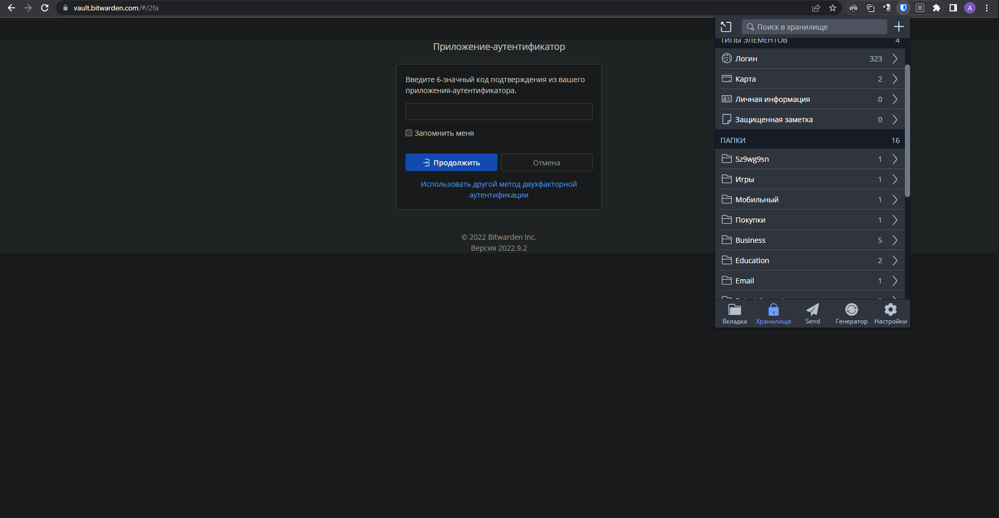
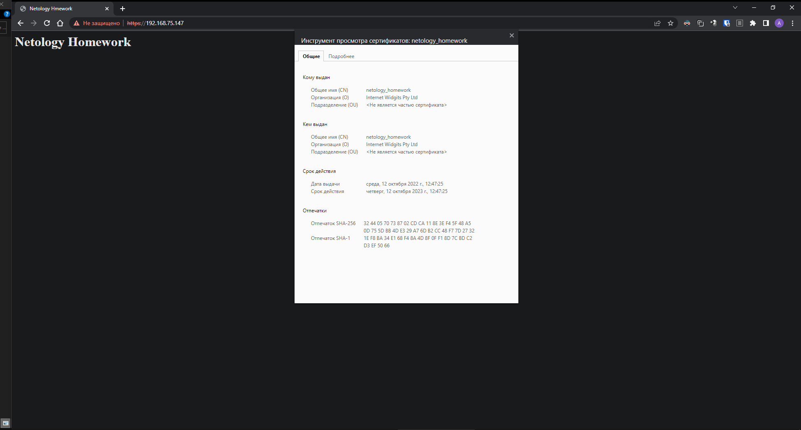
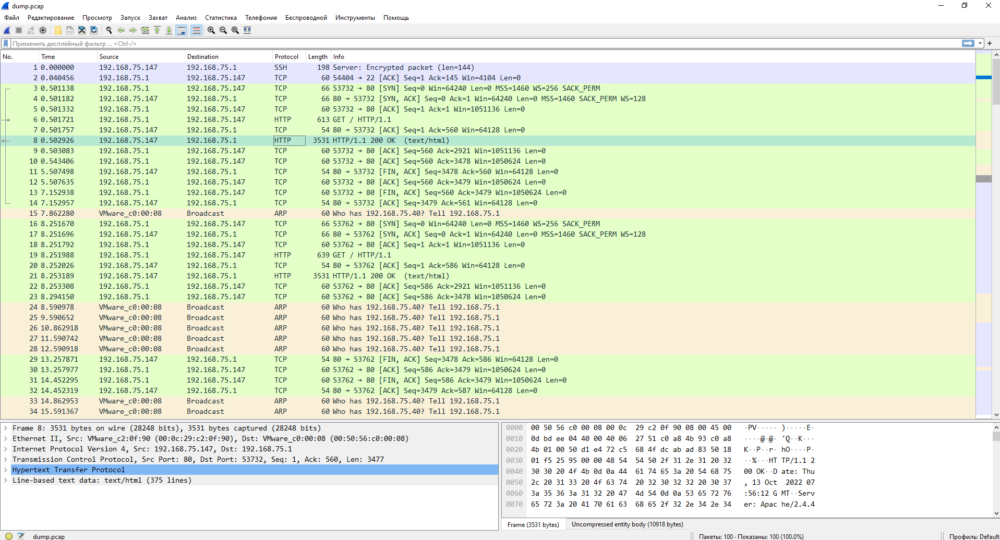

# Домашнее задание к занятию "3.9. Элементы безопасности информационных систем"


1. Установите Bitwarden плагин для браузера. Зарегестрируйтесь и сохраните несколько паролей.
2. Установите Google authenticator на мобильный телефон. Настройте вход в Bitwarden акаунт через Google authenticator OTP.

Решение 1 и 2 пункта:



3. Установите apache2, сгенерируйте самоподписанный сертификат, настройте тестовый сайт для работы по HTTPS.

```bash
root@serv1:~# apt install apache2
root@serv1:~# a2enmod ssl
root@serv1:~# openssl req -x509 -nodes -days 365 -newkey rsa:2048 -keyout /etc/ssl/private/apache-self-signed.key -out /etc/ssl/certs/apache-self-signed.crtcat 
root@serv1:/var/www# cat netology/html/index.html
<html>
    <head>
        <title>Netology Hmework</title>
    </head>
    <body>
        <h1>Netology Homework</h1>
    </body>
</html>
root@serv1:/var/www# cat /etc/apache2/sites-available/netology.conf
<VirtualHost *:443>
   ServerName netology
   DocumentRoot /var/www/netology/html

   SSLEngine on
   SSLCertificateFile /etc/ssl/certs/apache-self-signed.crt
   SSLCertificateKeyFile /etc/ssl/private/apache-self-signed.key
</VirtualHost>
root@serv1:/var/www# a2dissite 000-default.conf
Site 000-default disabled.
root@serv1:/var/www# a2ensite netology.conf
Enabling site netology.
To activate the new configuration, you need to run:
  systemctl reload apache2
root@serv1:/var/www# systemctl reload apache2
```



4. Проверьте на TLS уязвимости произвольный сайт в интернете (кроме сайтов МВД, ФСБ, МинОбр, НацБанк, РосКосмос, РосАтом, РосНАНО и любых госкомпаний, объектов КИИ, ВПК ... и тому подобное).

```bash
root@vagrant:/home/vagrant/check/testssl.sh# ./testssl.sh https://iphones.ru

###########################################################
    testssl.sh       3.0.8 from https://testssl.sh/

      This program is free software. Distribution and
             modification under GPLv2 permitted.
      USAGE w/o ANY WARRANTY. USE IT AT YOUR OWN RISK!

       Please file bugs @ https://testssl.sh/bugs/

###########################################################

 Using "OpenSSL 1.0.2-bad (1.0.2k-dev)" [~183 ciphers]
 on vagrant:./bin/openssl.Linux.x86_64
 (built: "Sep  1 14:03:44 2022", platform: "linux-x86_64")


Testing all IPv4 addresses (port 443): 188.114.99.234 188.114.98.234
--------------------------------------------------------------------------------------------------------------------------
 Start 2022-10-13 06:01:11        -->> 188.114.99.234:443 (iphones.ru) <<--

 Further IP addresses:   188.114.98.234 2a06:98c1:3123:e000::a 2a06:98c1:3122:e000::a
 rDNS (188.114.99.234):  --
 Service detected:       HTTP


 Testing protocols via sockets except NPN+ALPN

 SSLv2      not offered (OK)
 SSLv3      not offered (OK)
 TLS 1      offered (deprecated)
 TLS 1.1    offered (deprecated)
 TLS 1.2    offered (OK)
 TLS 1.3    offered (OK): final
 NPN/SPDY   h2, http/1.1 (advertised)
 ALPN/HTTP2 h2, http/1.1 (offered)

 Testing cipher categories

 NULL ciphers (no encryption)                  not offered (OK)
 Anonymous NULL Ciphers (no authentication)    not offered (OK)
 Export ciphers (w/o ADH+NULL)                 not offered (OK)
 LOW: 64 Bit + DES, RC[2,4] (w/o export)       not offered (OK)
 Triple DES Ciphers / IDEA                     offered
 Obsolete CBC ciphers (AES, ARIA etc.)         offered
 Strong encryption (AEAD ciphers)              offered (OK)


 Testing robust (perfect) forward secrecy, (P)FS -- omitting Null Authentication/Encryption, 3DES, RC4

 PFS is offered (OK)          TLS_AES_256_GCM_SHA384 TLS_CHACHA20_POLY1305_SHA256 ECDHE-ECDSA-CHACHA20-POLY1305-OLD ECDHE-RSA-CHACHA20-POLY1305-OLD ECDHE-RSA-AES256-GCM-SHA384
                              ECDHE-ECDSA-AES256-GCM-SHA384 ECDHE-RSA-AES256-SHA384 ECDHE-ECDSA-AES256-SHA384 ECDHE-RSA-AES256-SHA ECDHE-ECDSA-AES256-SHA
                              ECDHE-ECDSA-CHACHA20-POLY1305 ECDHE-RSA-CHACHA20-POLY1305 TLS_AES_128_GCM_SHA256 ECDHE-RSA-AES128-GCM-SHA256 ECDHE-ECDSA-AES128-GCM-SHA256
                              ECDHE-RSA-AES128-SHA256 ECDHE-ECDSA-AES128-SHA256 ECDHE-RSA-AES128-SHA ECDHE-ECDSA-AES128-SHA
 Elliptic curves offered:     prime256v1 secp384r1 secp521r1 X25519


 Testing server preferences

 Has server cipher order?     yes (OK) -- only for < TLS 1.3
 Negotiated protocol          TLSv1.3
 Negotiated cipher            TLS_AES_256_GCM_SHA384, 253 bit ECDH (X25519)
 Cipher order
    TLSv1:     ECDHE-RSA-AES128-SHA AES128-SHA ECDHE-RSA-AES256-SHA AES256-SHA DES-CBC3-SHA
    TLSv1.1:   ECDHE-RSA-AES128-SHA AES128-SHA ECDHE-RSA-AES256-SHA AES256-SHA
    TLSv1.2:   ECDHE-ECDSA-AES128-GCM-SHA256 ECDHE-ECDSA-CHACHA20-POLY1305-OLD ECDHE-ECDSA-CHACHA20-POLY1305 ECDHE-ECDSA-AES128-SHA ECDHE-ECDSA-AES256-GCM-SHA384
               ECDHE-ECDSA-AES256-SHA ECDHE-ECDSA-AES128-SHA256 ECDHE-ECDSA-AES256-SHA384 ECDHE-RSA-AES128-GCM-SHA256 ECDHE-RSA-CHACHA20-POLY1305-OLD ECDHE-RSA-CHACHA20-POLY1305
               ECDHE-RSA-AES128-SHA AES128-GCM-SHA256 AES128-SHA ECDHE-RSA-AES256-GCM-SHA384 ECDHE-RSA-AES256-SHA AES256-GCM-SHA384 AES256-SHA ECDHE-RSA-AES128-SHA256 AES128-SHA256
               ECDHE-RSA-AES256-SHA384 AES256-SHA256


 Testing server defaults (Server Hello)

 TLS extensions (standard)    "server name/#0" "renegotiation info/#65281" "EC point formats/#11" "session ticket/#35" "next protocol/#13172" "key share/#51" "supported versions/#43"
                              "extended master secret/#23" "application layer protocol negotiation/#16"
 Session Ticket RFC 5077 hint 64800 seconds, session tickets keys seems to be rotated < daily
 SSL Session ID support       yes
 Session Resumption           Tickets: yes, ID: yes
 TLS clock skew               +3 sec from localtime

  Server Certificate #1
   Signature Algorithm          SHA256 with RSA
   Server key size              RSA 2048 bits
   Server key usage             Digital Signature, Key Encipherment
   Server extended key usage    TLS Web Server Authentication, TLS Web Client Authentication
   Serial                       04357411F939FEEBB879F1ACFC8630848DA6 (OK: length 18)
   Fingerprints                 SHA1 6E982E79F1602EA6969FAC09EF597A73C8360790
                                SHA256 6CB09C4BB23EFCF77BB425342209022843CEED8C57253B35EF1F34C2FD7444D0
   Common Name (CN)             *.iphones.ru  (CN in response to request w/o SNI: sni.cloudflaressl.com )
   subjectAltName (SAN)         *.iphones.ru iphones.ru
   Issuer                       R3 (Let's Encrypt from US)
   Trust (hostname)             Ok via SAN (SNI mandatory)
   Chain of trust               Ok
   EV cert (experimental)       no
   ETS/"eTLS", visibility info  not present
   Certificate Validity (UTC)   45 >= 30 days (2022-08-29 10:41 --> 2022-11-27 10:41)
   # of certificates provided   3
   Certificate Revocation List  --
   OCSP URI                     http://r3.o.lencr.org
   OCSP stapling                not offered
   OCSP must staple extension   --
   DNS CAA RR (experimental)    not offered
   Certificate Transparency     yes (certificate extension)

  Server Certificate #2
   Signature Algorithm          ECDSA with SHA384
   Server key size              EC 256 bits
   Server key usage             Digital Signature
   Server extended key usage    TLS Web Server Authentication, TLS Web Client Authentication
   Serial                       047BA8962E095372DE40A01A2C531ECE8D6B (OK: length 18)
   Fingerprints                 SHA1 5F7D0DAF0D0A2118C87248D23FFBE1AF81DCE46F
                                SHA256 58023BF2F55B34FB9DC7C54B0C6FB06F726D4DF1593952F884F918FE9299B507
   Common Name (CN)             *.iphones.ru  (CN in response to request w/o SNI: sni.cloudflaressl.com )
   subjectAltName (SAN)         *.iphones.ru iphones.ru
   Issuer                       E1 (Let's Encrypt from US)
   Trust (hostname)             Ok via SAN (SNI mandatory)
   Chain of trust               Ok
   EV cert (experimental)       no
   ETS/"eTLS", visibility info  not present
   Certificate Validity (UTC)   45 >= 30 days (2022-08-29 10:41 --> 2022-11-27 10:41)
   # of certificates provided   4
   Certificate Revocation List  --
   OCSP URI                     http://e1.o.lencr.org
   OCSP stapling                not offered
   OCSP must staple extension   --
   DNS CAA RR (experimental)    not offered
   Certificate Transparency     yes (certificate extension)


 Testing HTTP header response @ "/"

 HTTP Status Code             301 Moved Permanently, redirecting to "https://www.iphones.ru/"
 HTTP clock skew              +2 sec from localtime
 Strict Transport Security    not offered
 Public Key Pinning           --
 Server banner                cloudflare
 Application banner           X-Powered-By: PHP/7.3.27
 Cookie(s)                    2 issued: NONE secure, NONE HttpOnly -- maybe better try target URL of 30x
 Security headers             Cache-Control: no-store, no-cache, must-revalidate
                              Pragma: no-cache
 Reverse Proxy banner         --


 Testing vulnerabilities

 Heartbleed (CVE-2014-0160)                not vulnerable (OK), no heartbeat extension
 CCS (CVE-2014-0224)                       not vulnerable (OK)
 Ticketbleed (CVE-2016-9244), experiment.  not vulnerable (OK)
 ROBOT                                     not vulnerable (OK)
 Secure Renegotiation (RFC 5746)           supported (OK)
 Secure Client-Initiated Renegotiation     not vulnerable (OK)
 CRIME, TLS (CVE-2012-4929)                not vulnerable (OK)
 BREACH (CVE-2013-3587)                    no HTTP compression (OK)  - only supplied "/" tested
 POODLE, SSL (CVE-2014-3566)               not vulnerable (OK), no SSLv3 support
 TLS_FALLBACK_SCSV (RFC 7507)              Downgrade attack prevention supported (OK)
 SWEET32 (CVE-2016-2183, CVE-2016-6329)    VULNERABLE, uses 64 bit block ciphers
 FREAK (CVE-2015-0204)                     not vulnerable (OK)
 DROWN (CVE-2016-0800, CVE-2016-0703)      not vulnerable on this host and port (OK)
                                           make sure you don't use this certificate elsewhere with SSLv2 enabled services
                                           https://search.censys.io/search?resource=hosts&virtual_hosts=INCLUDE&q=6CB09C4BB23EFCF77BB425342209022843CEED8C57253B35EF1F34C2FD7444D0
 LOGJAM (CVE-2015-4000), experimental      not vulnerable (OK): no DH EXPORT ciphers, no DH key detected with <= TLS 1.2
 BEAST (CVE-2011-3389)                     TLS1: ECDHE-RSA-AES128-SHA AES128-SHA ECDHE-RSA-AES256-SHA AES256-SHA DES-CBC3-SHA
                                           VULNERABLE -- but also supports higher protocols  TLSv1.1 TLSv1.2 (likely mitigated)
 LUCKY13 (CVE-2013-0169), experimental     potentially VULNERABLE, uses cipher block chaining (CBC) ciphers with TLS. Check patches
 RC4 (CVE-2013-2566, CVE-2015-2808)        no RC4 ciphers detected (OK)


 Testing 370 ciphers via OpenSSL plus sockets against the server, ordered by encryption strength

Hexcode  Cipher Suite Name (OpenSSL)       KeyExch.   Encryption  Bits     Cipher Suite Name (IANA/RFC)
-----------------------------------------------------------------------------------------------------------------------------
 x1302   TLS_AES_256_GCM_SHA384            ECDH 253   AESGCM      256      TLS_AES_256_GCM_SHA384
 x1303   TLS_CHACHA20_POLY1305_SHA256      ECDH 253   ChaCha20    256      TLS_CHACHA20_POLY1305_SHA256
 xcc14   ECDHE-ECDSA-CHACHA20-POLY1305-OLD ECDH 256   ChaCha20    256      TLS_ECDHE_ECDSA_WITH_CHACHA20_POLY1305_SHA256_OLD
 xcc13   ECDHE-RSA-CHACHA20-POLY1305-OLD   ECDH 256   ChaCha20    256      TLS_ECDHE_RSA_WITH_CHACHA20_POLY1305_SHA256_OLD
 xc030   ECDHE-RSA-AES256-GCM-SHA384       ECDH 256   AESGCM      256      TLS_ECDHE_RSA_WITH_AES_256_GCM_SHA384
 xc02c   ECDHE-ECDSA-AES256-GCM-SHA384     ECDH 256   AESGCM      256      TLS_ECDHE_ECDSA_WITH_AES_256_GCM_SHA384
 xc028   ECDHE-RSA-AES256-SHA384           ECDH 256   AES         256      TLS_ECDHE_RSA_WITH_AES_256_CBC_SHA384
 xc024   ECDHE-ECDSA-AES256-SHA384         ECDH 256   AES         256      TLS_ECDHE_ECDSA_WITH_AES_256_CBC_SHA384
 xc014   ECDHE-RSA-AES256-SHA              ECDH 256   AES         256      TLS_ECDHE_RSA_WITH_AES_256_CBC_SHA
 xc00a   ECDHE-ECDSA-AES256-SHA            ECDH 256   AES         256      TLS_ECDHE_ECDSA_WITH_AES_256_CBC_SHA
 xcca9   ECDHE-ECDSA-CHACHA20-POLY1305     ECDH 253   ChaCha20    256      TLS_ECDHE_ECDSA_WITH_CHACHA20_POLY1305_SHA256
 xcca8   ECDHE-RSA-CHACHA20-POLY1305       ECDH 253   ChaCha20    256      TLS_ECDHE_RSA_WITH_CHACHA20_POLY1305_SHA256
 x9d     AES256-GCM-SHA384                 RSA        AESGCM      256      TLS_RSA_WITH_AES_256_GCM_SHA384
 x3d     AES256-SHA256                     RSA        AES         256      TLS_RSA_WITH_AES_256_CBC_SHA256
 x35     AES256-SHA                        RSA        AES         256      TLS_RSA_WITH_AES_256_CBC_SHA
 x1301   TLS_AES_128_GCM_SHA256            ECDH 253   AESGCM      128      TLS_AES_128_GCM_SHA256
 xc02f   ECDHE-RSA-AES128-GCM-SHA256       ECDH 256   AESGCM      128      TLS_ECDHE_RSA_WITH_AES_128_GCM_SHA256
 xc02b   ECDHE-ECDSA-AES128-GCM-SHA256     ECDH 256   AESGCM      128      TLS_ECDHE_ECDSA_WITH_AES_128_GCM_SHA256
 xc027   ECDHE-RSA-AES128-SHA256           ECDH 256   AES         128      TLS_ECDHE_RSA_WITH_AES_128_CBC_SHA256
 xc023   ECDHE-ECDSA-AES128-SHA256         ECDH 256   AES         128      TLS_ECDHE_ECDSA_WITH_AES_128_CBC_SHA256
 xc013   ECDHE-RSA-AES128-SHA              ECDH 256   AES         128      TLS_ECDHE_RSA_WITH_AES_128_CBC_SHA
 xc009   ECDHE-ECDSA-AES128-SHA            ECDH 256   AES         128      TLS_ECDHE_ECDSA_WITH_AES_128_CBC_SHA
 x9c     AES128-GCM-SHA256                 RSA        AESGCM      128      TLS_RSA_WITH_AES_128_GCM_SHA256
 x3c     AES128-SHA256                     RSA        AES         128      TLS_RSA_WITH_AES_128_CBC_SHA256
 x2f     AES128-SHA                        RSA        AES         128      TLS_RSA_WITH_AES_128_CBC_SHA
 x0a     DES-CBC3-SHA                      RSA        3DES        168      TLS_RSA_WITH_3DES_EDE_CBC_SHA


 Running client simulations (HTTP) via sockets

 Android 6.0                  TLSv1.2 ECDHE-ECDSA-CHACHA20-POLY1305-OLD, 256 bit ECDH (P-256)
 Android 7.0 (native)         TLSv1.2 ECDHE-ECDSA-AES128-GCM-SHA256, 256 bit ECDH (P-256)
 Android 8.1 (native)         TLSv1.2 ECDHE-ECDSA-AES128-GCM-SHA256, 253 bit ECDH (X25519)
 Android 9.0 (native)         TLSv1.3 TLS_AES_128_GCM_SHA256, 253 bit ECDH (X25519)
 Android 10.0 (native)        TLSv1.3 TLS_AES_128_GCM_SHA256, 253 bit ECDH (X25519)
 Android 11 (native)          TLSv1.3 TLS_AES_128_GCM_SHA256, 253 bit ECDH (X25519)
 Android 12 (native)          TLSv1.3 TLS_AES_128_GCM_SHA256, 253 bit ECDH (X25519)
 Chrome 79 (Win 10)           TLSv1.3 TLS_AES_128_GCM_SHA256, 253 bit ECDH (X25519)
 Chrome 101 (Win 10)          TLSv1.3 TLS_AES_128_GCM_SHA256, 253 bit ECDH (X25519)
 Firefox 66 (Win 8.1/10)      TLSv1.3 TLS_AES_128_GCM_SHA256, 253 bit ECDH (X25519)
 Firefox 100 (Win 10)         TLSv1.3 TLS_AES_128_GCM_SHA256, 253 bit ECDH (X25519)
 IE 6 XP                      No connection
 IE 8 Win 7                   TLSv1.0 ECDHE-RSA-AES128-SHA, 256 bit ECDH (P-256)
 IE 8 XP                      TLSv1.0 DES-CBC3-SHA, No FS
 IE 11 Win 7                  TLSv1.2 ECDHE-ECDSA-AES128-GCM-SHA256, 256 bit ECDH (P-256)
 IE 11 Win 8.1                TLSv1.2 ECDHE-ECDSA-AES128-GCM-SHA256, 256 bit ECDH (P-256)
 IE 11 Win Phone 8.1          TLSv1.2 ECDHE-ECDSA-AES128-GCM-SHA256, 256 bit ECDH (P-256)
 IE 11 Win 10                 TLSv1.2 ECDHE-ECDSA-AES128-GCM-SHA256, 256 bit ECDH (P-256)
 Edge 15 Win 10               TLSv1.2 ECDHE-ECDSA-AES128-GCM-SHA256, 253 bit ECDH (X25519)
 Edge 101 Win 10 21H2         TLSv1.3 TLS_AES_128_GCM_SHA256, 253 bit ECDH (X25519)
 Safari 12.1 (iOS 12.2)       TLSv1.3 TLS_CHACHA20_POLY1305_SHA256, 253 bit ECDH (X25519)
 Safari 13.0 (macOS 10.14.6)  TLSv1.3 TLS_CHACHA20_POLY1305_SHA256, 253 bit ECDH (X25519)
 Safari 15.4 (macOS 12.3.1)   TLSv1.3 TLS_AES_128_GCM_SHA256, 253 bit ECDH (X25519)
 Java 7u25                    TLSv1.0 ECDHE-RSA-AES128-SHA, 256 bit ECDH (P-256)
 Java 8u161                   TLSv1.2 ECDHE-ECDSA-AES128-GCM-SHA256, 256 bit ECDH (P-256)
 Java 11.0.2 (OpenJDK)        TLSv1.3 TLS_AES_128_GCM_SHA256, 256 bit ECDH (P-256)
 Java 17.0.3 (OpenJDK)        TLSv1.3 TLS_AES_256_GCM_SHA384, 253 bit ECDH (X25519)
 go 1.17.8                    TLSv1.3 TLS_AES_128_GCM_SHA256, 253 bit ECDH (X25519)
 LibreSSL 2.8.3 (Apple)       TLSv1.2 ECDHE-ECDSA-CHACHA20-POLY1305, 253 bit ECDH (X25519)
 OpenSSL 1.0.2e               TLSv1.2 ECDHE-ECDSA-AES128-GCM-SHA256, 256 bit ECDH (P-256)
 OpenSSL 1.1.0l (Debian)      TLSv1.2 ECDHE-ECDSA-CHACHA20-POLY1305, 253 bit ECDH (X25519)
 OpenSSL 1.1.1d (Debian)      TLSv1.3 TLS_AES_256_GCM_SHA384, 253 bit ECDH (X25519)
 OpenSSL 3.0.3 (git)          TLSv1.3 TLS_AES_256_GCM_SHA384, 253 bit ECDH (X25519)
 Apple Mail (16.0)            TLSv1.2 ECDHE-ECDSA-AES128-GCM-SHA256, 256 bit ECDH (P-256)
 Thunderbird (91.9)           TLSv1.3 TLS_AES_128_GCM_SHA256, 253 bit ECDH (X25519)

 Done 2022-10-13 06:03:11 [ 121s] -->> 188.114.99.234:443 (iphones.ru) <<--

--------------------------------------------------------------------------------------------------------------------------
 Start 2022-10-13 06:03:11        -->> 188.114.98.234:443 (iphones.ru) <<--

 Further IP addresses:   188.114.99.234 2a06:98c1:3123:e000::a 2a06:98c1:3122:e000::a
 rDNS (188.114.98.234):  --
 Service detected:       HTTP


 Testing protocols via sockets except NPN+ALPN

 SSLv2      not offered (OK)
 SSLv3      not offered (OK)
 TLS 1      not offered
 TLS 1.1    offered (deprecated)
 TLS 1.2    offered (OK)
 TLS 1.3    offered (OK): final
 NPN/SPDY   h2, http/1.1 (advertised)
 ALPN/HTTP2 h2, http/1.1 (offered)

 Testing cipher categories

 NULL ciphers (no encryption)                  not offered (OK)
 Anonymous NULL Ciphers (no authentication)    not offered (OK)
 Export ciphers (w/o ADH+NULL)                 not offered (OK)
 LOW: 64 Bit + DES, RC[2,4] (w/o export)       not offered (OK)
 Triple DES Ciphers / IDEA                     not offered
 Obsolete CBC ciphers (AES, ARIA etc.)         offered
 Strong encryption (AEAD ciphers)              offered (OK)


 Testing robust (perfect) forward secrecy, (P)FS -- omitting Null Authentication/Encryption, 3DES, RC4

 PFS is offered (OK)          TLS_AES_256_GCM_SHA384 TLS_CHACHA20_POLY1305_SHA256 ECDHE-ECDSA-CHACHA20-POLY1305-OLD ECDHE-RSA-CHACHA20-POLY1305-OLD ECDHE-RSA-AES256-GCM-SHA384
                              ECDHE-ECDSA-AES256-GCM-SHA384 ECDHE-RSA-AES256-SHA384 ECDHE-ECDSA-AES256-SHA384 ECDHE-RSA-AES256-SHA ECDHE-ECDSA-AES256-SHA
                              ECDHE-ECDSA-CHACHA20-POLY1305 ECDHE-RSA-CHACHA20-POLY1305 TLS_AES_128_GCM_SHA256 ECDHE-RSA-AES128-GCM-SHA256 ECDHE-ECDSA-AES128-GCM-SHA256
                              ECDHE-RSA-AES128-SHA256 ECDHE-ECDSA-AES128-SHA256 ECDHE-RSA-AES128-SHA ECDHE-ECDSA-AES128-SHA
 Elliptic curves offered:     prime256v1 secp384r1 secp521r1 X25519


 Testing server preferences

 Has server cipher order?     yes (OK) -- only for < TLS 1.3
 Negotiated protocol          TLSv1.3
 Negotiated cipher            TLS_AES_256_GCM_SHA384, 253 bit ECDH (X25519)
 Cipher order
    TLSv1.1:   ECDHE-RSA-AES128-SHA AES128-SHA ECDHE-RSA-AES256-SHA AES256-SHA
    TLSv1.2:   ECDHE-ECDSA-AES128-GCM-SHA256 ECDHE-ECDSA-CHACHA20-POLY1305-OLD ECDHE-ECDSA-CHACHA20-POLY1305 ECDHE-ECDSA-AES128-SHA ECDHE-ECDSA-AES256-GCM-SHA384
               ECDHE-ECDSA-AES256-SHA ECDHE-ECDSA-AES128-SHA256 ECDHE-ECDSA-AES256-SHA384 ECDHE-RSA-AES128-GCM-SHA256 ECDHE-RSA-CHACHA20-POLY1305-OLD ECDHE-RSA-CHACHA20-POLY1305
               ECDHE-RSA-AES128-SHA AES128-GCM-SHA256 AES128-SHA ECDHE-RSA-AES256-GCM-SHA384 ECDHE-RSA-AES256-SHA AES256-GCM-SHA384 AES256-SHA ECDHE-RSA-AES128-SHA256 AES128-SHA256
               ECDHE-RSA-AES256-SHA384 AES256-SHA256


 Testing server defaults (Server Hello)

 TLS extensions (standard)    "server name/#0" "renegotiation info/#65281" "EC point formats/#11" "session ticket/#35" "next protocol/#13172" "key share/#51" "supported versions/#43"
                              "extended master secret/#23" "application layer protocol negotiation/#16"
 Session Ticket RFC 5077 hint 64800 seconds, session tickets keys seems to be rotated < daily
 SSL Session ID support       yes
 Session Resumption           Tickets: yes, ID: yes
 TLS clock skew               +3 sec from localtime

  Server Certificate #1
   Signature Algorithm          SHA256 with RSA
   Server key size              RSA 2048 bits
   Server key usage             Digital Signature, Key Encipherment
   Server extended key usage    TLS Web Server Authentication, TLS Web Client Authentication
   Serial                       04357411F939FEEBB879F1ACFC8630848DA6 (OK: length 18)
   Fingerprints                 SHA1 6E982E79F1602EA6969FAC09EF597A73C8360790
                                SHA256 6CB09C4BB23EFCF77BB425342209022843CEED8C57253B35EF1F34C2FD7444D0
   Common Name (CN)             *.iphones.ru  (CN in response to request w/o SNI: sni.cloudflaressl.com )
   subjectAltName (SAN)         *.iphones.ru iphones.ru
   Issuer                       R3 (Let's Encrypt from US)
   Trust (hostname)             Ok via SAN (SNI mandatory)
   Chain of trust               Ok
   EV cert (experimental)       no
   ETS/"eTLS", visibility info  not present
   Certificate Validity (UTC)   45 >= 30 days (2022-08-29 10:41 --> 2022-11-27 10:41)
   # of certificates provided   3
   Certificate Revocation List  --
   OCSP URI                     http://r3.o.lencr.org
   OCSP stapling                not offered
   OCSP must staple extension   --
   DNS CAA RR (experimental)    not offered
   Certificate Transparency     yes (certificate extension)

  Server Certificate #2
   Signature Algorithm          ECDSA with SHA384
   Server key size              EC 256 bits
   Server key usage             Digital Signature
   Server extended key usage    TLS Web Server Authentication, TLS Web Client Authentication
   Serial                       047BA8962E095372DE40A01A2C531ECE8D6B (OK: length 18)
   Fingerprints                 SHA1 5F7D0DAF0D0A2118C87248D23FFBE1AF81DCE46F
                                SHA256 58023BF2F55B34FB9DC7C54B0C6FB06F726D4DF1593952F884F918FE9299B507
   Common Name (CN)             *.iphones.ru  (CN in response to request w/o SNI: sni.cloudflaressl.com )
   subjectAltName (SAN)         *.iphones.ru iphones.ru
   Issuer                       E1 (Let's Encrypt from US)
   Trust (hostname)             Ok via SAN (SNI mandatory)
   Chain of trust               Ok
   EV cert (experimental)       no
   ETS/"eTLS", visibility info  not present
   Certificate Validity (UTC)   45 >= 30 days (2022-08-29 10:41 --> 2022-11-27 10:41)
   # of certificates provided   4
   Certificate Revocation List  --
   OCSP URI                     http://e1.o.lencr.org
   OCSP stapling                not offered
   OCSP must staple extension   --
   DNS CAA RR (experimental)    not offered
   Certificate Transparency     yes (certificate extension)


 Testing HTTP header response @ "/"

 HTTP Status Code             301 Moved Permanently, redirecting to "https://www.iphones.ru/"
 HTTP clock skew              +2 sec from localtime
 Strict Transport Security    not offered
 Public Key Pinning           --
 Server banner                cloudflare
 Application banner           X-Powered-By: PHP/7.3.27
 Cookie(s)                    2 issued: NONE secure, NONE HttpOnly -- maybe better try target URL of 30x
 Security headers             Cache-Control: no-store, no-cache, must-revalidate
                              Pragma: no-cache
 Reverse Proxy banner         --


 Testing vulnerabilities

 Heartbleed (CVE-2014-0160)                not vulnerable (OK), no heartbeat extension
 CCS (CVE-2014-0224)                       not vulnerable (OK)
 Ticketbleed (CVE-2016-9244), experiment.  not vulnerable (OK)
 ROBOT                                     not vulnerable (OK)
 Secure Renegotiation (RFC 5746)           supported (OK)
 Secure Client-Initiated Renegotiation     not vulnerable (OK)
 CRIME, TLS (CVE-2012-4929)                not vulnerable (OK)
 BREACH (CVE-2013-3587)                    no HTTP compression (OK)  - only supplied "/" tested
 POODLE, SSL (CVE-2014-3566)               not vulnerable (OK), no SSLv3 support
 TLS_FALLBACK_SCSV (RFC 7507)              Downgrade attack prevention supported (OK)
 SWEET32 (CVE-2016-2183, CVE-2016-6329)    not vulnerable (OK)
 FREAK (CVE-2015-0204)                     not vulnerable (OK)
 DROWN (CVE-2016-0800, CVE-2016-0703)      not vulnerable on this host and port (OK)
                                           make sure you don't use this certificate elsewhere with SSLv2 enabled services
                                           https://search.censys.io/search?resource=hosts&virtual_hosts=INCLUDE&q=6CB09C4BB23EFCF77BB425342209022843CEED8C57253B35EF1F34C2FD7444D0
 LOGJAM (CVE-2015-4000), experimental      not vulnerable (OK): no DH EXPORT ciphers, no DH key detected with <= TLS 1.2
 BEAST (CVE-2011-3389)                     not vulnerable (OK), no SSL3 or TLS1
 LUCKY13 (CVE-2013-0169), experimental     potentially VULNERABLE, uses cipher block chaining (CBC) ciphers with TLS. Check patches
 RC4 (CVE-2013-2566, CVE-2015-2808)        no RC4 ciphers detected (OK)


 Testing 370 ciphers via OpenSSL plus sockets against the server, ordered by encryption strength

Hexcode  Cipher Suite Name (OpenSSL)       KeyExch.   Encryption  Bits     Cipher Suite Name (IANA/RFC)
-----------------------------------------------------------------------------------------------------------------------------
 x1302   TLS_AES_256_GCM_SHA384            ECDH 253   AESGCM      256      TLS_AES_256_GCM_SHA384
 x1303   TLS_CHACHA20_POLY1305_SHA256      ECDH 253   ChaCha20    256      TLS_CHACHA20_POLY1305_SHA256
 xcc14   ECDHE-ECDSA-CHACHA20-POLY1305-OLD ECDH 256   ChaCha20    256      TLS_ECDHE_ECDSA_WITH_CHACHA20_POLY1305_SHA256_OLD
 xcc13   ECDHE-RSA-CHACHA20-POLY1305-OLD   ECDH 256   ChaCha20    256      TLS_ECDHE_RSA_WITH_CHACHA20_POLY1305_SHA256_OLD
 xc030   ECDHE-RSA-AES256-GCM-SHA384       ECDH 256   AESGCM      256      TLS_ECDHE_RSA_WITH_AES_256_GCM_SHA384
 xc02c   ECDHE-ECDSA-AES256-GCM-SHA384     ECDH 256   AESGCM      256      TLS_ECDHE_ECDSA_WITH_AES_256_GCM_SHA384
 xc028   ECDHE-RSA-AES256-SHA384           ECDH 256   AES         256      TLS_ECDHE_RSA_WITH_AES_256_CBC_SHA384
 xc024   ECDHE-ECDSA-AES256-SHA384         ECDH 256   AES         256      TLS_ECDHE_ECDSA_WITH_AES_256_CBC_SHA384
 xc014   ECDHE-RSA-AES256-SHA              ECDH 256   AES         256      TLS_ECDHE_RSA_WITH_AES_256_CBC_SHA
 xc00a   ECDHE-ECDSA-AES256-SHA            ECDH 256   AES         256      TLS_ECDHE_ECDSA_WITH_AES_256_CBC_SHA
 xcca9   ECDHE-ECDSA-CHACHA20-POLY1305     ECDH 253   ChaCha20    256      TLS_ECDHE_ECDSA_WITH_CHACHA20_POLY1305_SHA256
 xcca8   ECDHE-RSA-CHACHA20-POLY1305       ECDH 253   ChaCha20    256      TLS_ECDHE_RSA_WITH_CHACHA20_POLY1305_SHA256
 x9d     AES256-GCM-SHA384                 RSA        AESGCM      256      TLS_RSA_WITH_AES_256_GCM_SHA384
 x3d     AES256-SHA256                     RSA        AES         256      TLS_RSA_WITH_AES_256_CBC_SHA256
 x35     AES256-SHA                        RSA        AES         256      TLS_RSA_WITH_AES_256_CBC_SHA
 x1301   TLS_AES_128_GCM_SHA256            ECDH 253   AESGCM      128      TLS_AES_128_GCM_SHA256
 xc02f   ECDHE-RSA-AES128-GCM-SHA256       ECDH 256   AESGCM      128      TLS_ECDHE_RSA_WITH_AES_128_GCM_SHA256
 xc02b   ECDHE-ECDSA-AES128-GCM-SHA256     ECDH 256   AESGCM      128      TLS_ECDHE_ECDSA_WITH_AES_128_GCM_SHA256
 xc027   ECDHE-RSA-AES128-SHA256           ECDH 256   AES         128      TLS_ECDHE_RSA_WITH_AES_128_CBC_SHA256
 xc023   ECDHE-ECDSA-AES128-SHA256         ECDH 256   AES         128      TLS_ECDHE_ECDSA_WITH_AES_128_CBC_SHA256
 xc013   ECDHE-RSA-AES128-SHA              ECDH 256   AES         128      TLS_ECDHE_RSA_WITH_AES_128_CBC_SHA
 xc009   ECDHE-ECDSA-AES128-SHA            ECDH 256   AES         128      TLS_ECDHE_ECDSA_WITH_AES_128_CBC_SHA
 x9c     AES128-GCM-SHA256                 RSA        AESGCM      128      TLS_RSA_WITH_AES_128_GCM_SHA256
 x3c     AES128-SHA256                     RSA        AES         128      TLS_RSA_WITH_AES_128_CBC_SHA256
 x2f     AES128-SHA                        RSA        AES         128      TLS_RSA_WITH_AES_128_CBC_SHA
 x0a     DES-CBC3-SHA                      RSA        3DES        168      TLS_RSA_WITH_3DES_EDE_CBC_SHA


 Running client simulations (HTTP) via sockets

 Android 6.0                  TLSv1.2 ECDHE-ECDSA-CHACHA20-POLY1305-OLD, 256 bit ECDH (P-256)
 Android 7.0 (native)         TLSv1.2 ECDHE-ECDSA-AES128-GCM-SHA256, 256 bit ECDH (P-256)
 Android 8.1 (native)         TLSv1.2 ECDHE-ECDSA-AES128-GCM-SHA256, 253 bit ECDH (X25519)
 Android 9.0 (native)         TLSv1.3 TLS_AES_128_GCM_SHA256, 253 bit ECDH (X25519)
 Android 10.0 (native)        TLSv1.3 TLS_AES_128_GCM_SHA256, 253 bit ECDH (X25519)
 Android 11 (native)          TLSv1.3 TLS_AES_128_GCM_SHA256, 253 bit ECDH (X25519)
 Android 12 (native)          TLSv1.3 TLS_AES_128_GCM_SHA256, 253 bit ECDH (X25519)
 Chrome 79 (Win 10)           TLSv1.3 TLS_AES_128_GCM_SHA256, 253 bit ECDH (X25519)
 Chrome 101 (Win 10)          TLSv1.3 TLS_AES_128_GCM_SHA256, 253 bit ECDH (X25519)
 Firefox 66 (Win 8.1/10)      TLSv1.3 TLS_AES_128_GCM_SHA256, 253 bit ECDH (X25519)
 Firefox 100 (Win 10)         TLSv1.3 TLS_AES_128_GCM_SHA256, 253 bit ECDH (X25519)
 IE 6 XP                      No connection
 IE 8 Win 7                   TLSv1.0 ECDHE-RSA-AES128-SHA, 256 bit ECDH (P-256)
 IE 8 XP                      TLSv1.0 DES-CBC3-SHA, No FS
 IE 11 Win 7                  TLSv1.2 ECDHE-ECDSA-AES128-GCM-SHA256, 256 bit ECDH (P-256)
 IE 11 Win 8.1                TLSv1.2 ECDHE-ECDSA-AES128-GCM-SHA256, 256 bit ECDH (P-256)
 IE 11 Win Phone 8.1          TLSv1.2 ECDHE-ECDSA-AES128-GCM-SHA256, 256 bit ECDH (P-256)
 IE 11 Win 10                 TLSv1.2 ECDHE-ECDSA-AES128-GCM-SHA256, 256 bit ECDH (P-256)
 Edge 15 Win 10               TLSv1.2 ECDHE-ECDSA-AES128-GCM-SHA256, 253 bit ECDH (X25519)
 Edge 101 Win 10 21H2         TLSv1.3 TLS_AES_128_GCM_SHA256, 253 bit ECDH (X25519)
 Safari 12.1 (iOS 12.2)       TLSv1.3 TLS_CHACHA20_POLY1305_SHA256, 253 bit ECDH (X25519)
 Safari 13.0 (macOS 10.14.6)  TLSv1.3 TLS_CHACHA20_POLY1305_SHA256, 253 bit ECDH (X25519)
 Safari 15.4 (macOS 12.3.1)   TLSv1.3 TLS_AES_128_GCM_SHA256, 253 bit ECDH (X25519)
 Java 7u25                    TLSv1.0 ECDHE-RSA-AES128-SHA, 256 bit ECDH (P-256)
 Java 8u161                   TLSv1.2 ECDHE-ECDSA-AES128-GCM-SHA256, 256 bit ECDH (P-256)
 Java 11.0.2 (OpenJDK)        TLSv1.3 TLS_AES_128_GCM_SHA256, 256 bit ECDH (P-256)
 Java 17.0.3 (OpenJDK)        TLSv1.3 TLS_AES_256_GCM_SHA384, 253 bit ECDH (X25519)
 go 1.17.8                    TLSv1.3 TLS_AES_128_GCM_SHA256, 253 bit ECDH (X25519)
 LibreSSL 2.8.3 (Apple)       TLSv1.2 ECDHE-ECDSA-CHACHA20-POLY1305, 253 bit ECDH (X25519)
 OpenSSL 1.0.2e               TLSv1.2 ECDHE-ECDSA-AES128-GCM-SHA256, 256 bit ECDH (P-256)
 OpenSSL 1.1.0l (Debian)      TLSv1.2 ECDHE-ECDSA-CHACHA20-POLY1305, 253 bit ECDH (X25519)
 OpenSSL 1.1.1d (Debian)      TLSv1.3 TLS_AES_256_GCM_SHA384, 253 bit ECDH (X25519)
 OpenSSL 3.0.3 (git)          TLSv1.3 TLS_AES_256_GCM_SHA384, 253 bit ECDH (X25519)
 Apple Mail (16.0)            TLSv1.2 ECDHE-ECDSA-AES128-GCM-SHA256, 256 bit ECDH (P-256)
 Thunderbird (91.9)           TLSv1.3 TLS_AES_128_GCM_SHA256, 253 bit ECDH (X25519)

 Done 2022-10-13 06:05:11 [ 241s] -->> 188.114.98.234:443 (iphones.ru) <<--

--------------------------------------------------------------------------------------------------------------------------
Done testing now all IP addresses (on port 443): 188.114.99.234 188.114.98.234

```

5. Установите на Ubuntu ssh сервер, сгенерируйте новый приватный ключ. Скопируйте свой публичный ключ на другой сервер. Подключитесь к серверу по SSH-ключу.
 
```bash
root@serv1:~# ssh-keygen
Generating public/private rsa key pair.
Enter file in which to save the key (/root/.ssh/id_rsa):
Enter passphrase (empty for no passphrase):
Enter same passphrase again:
Your identification has been saved in /root/.ssh/id_rsa
Your public key has been saved in /root/.ssh/id_rsa.pub
The key fingerprint is:
SHA256:UfO9bDZmD3yWbkoDuTkMtBAdZvs7lxjv9GHWIwijKMg root@serv1
The key's randomart image is:
+---[RSA 3072]----+
|       ..++      |
|        +o.o .   |
|       ..o  . .  |
|        o.o .o ..|
|        S= =  @.o|
|. .   . . = X=o*.|
| E . . .   X O Bo|
|    .       B O o|
|             o . |
+----[SHA256]-----+
root@serv1:~# ssh-copy-id 192.168.75.66
/usr/bin/ssh-copy-id: INFO: Source of key(s) to be installed: "/root/.ssh/id_rsa.pub"
The authenticity of host '192.168.75.66 (192.168.75.66)' can't be established.
ECDSA key fingerprint is SHA256:HCLtAsXM0hHn9hryubsl+eUCaNqGf73on6KpwxtBNjM.
Are you sure you want to continue connecting (yes/no/[fingerprint])? yes
/usr/bin/ssh-copy-id: INFO: attempting to log in with the new key(s), to filter out any that are already installed
/usr/bin/ssh-copy-id: INFO: 1 key(s) remain to be installed -- if you are prompted now it is to install the new keys
root@192.168.75.66's password:

Number of key(s) added: 1

Now try logging into the machine, with:   "ssh '192.168.75.66'"
and check to make sure that only the key(s) you wanted were added.

root@serv1:~# ssh 192.168.75.66
Last login: Thu Oct 13 15:08:05 2022
[root@docker ~]#

```
 
6. Переименуйте файлы ключей из задания 5. Настройте файл конфигурации SSH клиента, так чтобы вход на удаленный сервер осуществлялся по имени сервера.

```bash
root@serv1:~/.ssh# mv id_rsa id_rsa.old
root@serv1:~/.ssh# mv id_rsa.pub id_rsa.pub.old
root@serv1:~/.ssh# cat config
Host docker
HostName 192.168.75.66
Port 22
IdentityFile ~/.ssh/id_rsa.old
root@serv1:~# ssh docker
Last login: Thu Oct 13 15:16:38 2022
[root@docker ~]#
```


7. Соберите дамп трафика утилитой tcpdump в формате pcap, 100 пакетов. Откройте файл pcap в Wireshark.

```bash
root@serv1:~# tcpdump -c 100 -i ens33 -w dump.pcap
tcpdump: listening on ens33, link-type EN10MB (Ethernet), capture size 262144 bytes
100 packets captured
103 packets received by filter
0 packets dropped by kernel
```

